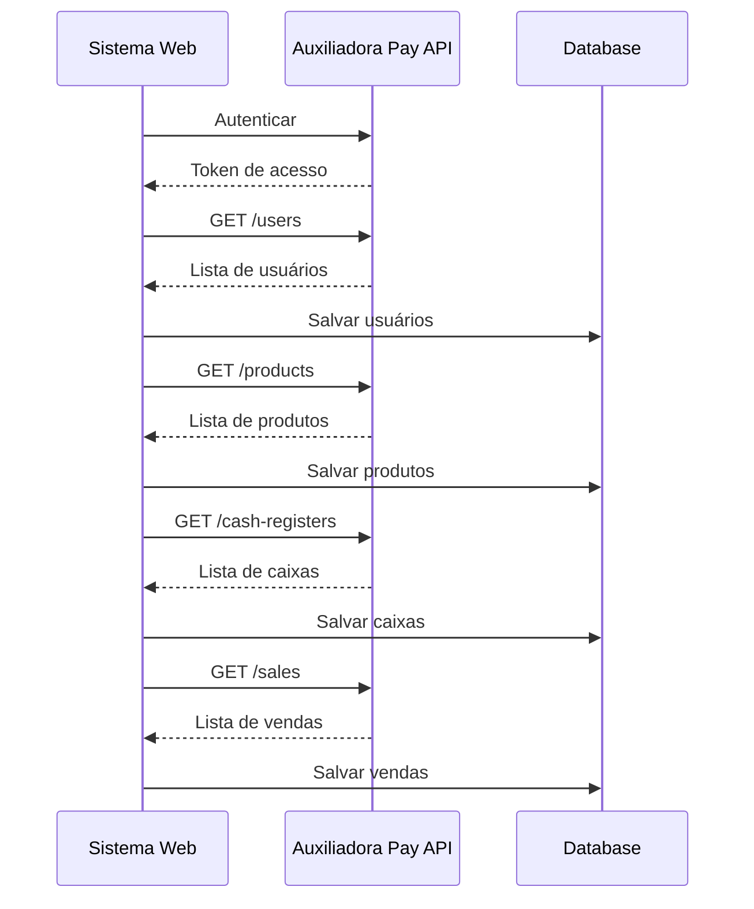
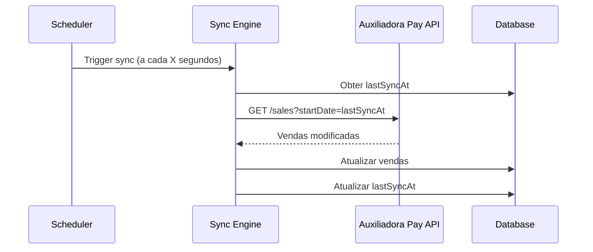

# Arquitetura do Sistema Web de Integração - Auxiliadora Pay

## Visão Geral

Sistema web para integração e sincronização de dados de vendas com o PDV Auxiliadora Pay, desenvolvido com Next.js, TypeScript e PostgreSQL.

## Arquitetura do Sistema

### 1. Camadas da Aplicação

```
┌─────────────────────────────────────────────────────────────┐
│                    Frontend (Next.js)                      │
├─────────────────────────────────────────────────────────────┤
│                    API Routes (Next.js)                    │
├─────────────────────────────────────────────────────────────┤
│                 Business Logic Layer                       │
├─────────────────────────────────────────────────────────────┤
│              Data Access Layer (Prisma)                    │
├─────────────────────────────────────────────────────────────┤
│                Database (PostgreSQL)                       │
└─────────────────────────────────────────────────────────────┘
```

### 2. Componentes Principais

#### 2.1 API Client (Auxiliadora Pay)
- **Responsabilidade**: Comunicação com a API externa
- **Funcionalidades**:
  - Autenticação e autorização
  - Requisições HTTP com retry e timeout
  - Rate limiting e throttling
  - Cache de respostas

#### 2.2 Sync Engine
- **Responsabilidade**: Sincronização de dados em tempo real
- **Funcionalidades**:
  - Polling inteligente
  - WebSockets para atualizações em tempo real
  - Detecção de mudanças (delta sync)
  - Resolução de conflitos

#### 2.3 Data Storage
- **Responsabilidade**: Armazenamento seguro e organizado
- **Funcionalidades**:
  - Modelo de dados normalizado
  - Backup automático
  - Criptografia de dados sensíveis
  - Auditoria de mudanças

#### 2.4 Error Handling & Monitoring
- **Responsabilidade**: Tratamento de erros e monitoramento
- **Funcionalidades**:
  - Logs estruturados
  - Alertas em tempo real
  - Métricas de performance
  - Health checks

## Estrutura de Dados

### 3.1 Entidades Principais

```typescript
// Usuários
interface User {
  id: string;
  email: string;
  name: string;
  role: 'USER' | 'ADMIN';
  active: boolean;
  createdAt: Date;
  updatedAt: Date;
  lastSyncAt?: Date;
}

// Produtos
interface Product {
  id: string;
  name: string;
  description?: string;
  price: number;
  imageUri?: string;
  active: boolean;
  createdAt: Date;
  updatedAt: Date;
  lastSyncAt?: Date;
}

// Caixas Registradoras
interface CashRegister {
  id: string;
  userId: string;
  status: 'OPEN' | 'CLOSED';
  initialAmount: number;
  currentAmount: number;
  finalAmount?: number;
  createdAt: Date;
  updatedAt: Date;
  lastSyncAt?: Date;
}

// Vendas
interface Sale {
  id: string;
  cashRegisterId: string;
  userId: string;
  items: SaleItem[];
  total: number;
  paymentMethod: 'CASH' | 'CARD' | 'PIX';
  status: 'PENDING' | 'COMPLETED' | 'CANCELLED';
  createdAt: Date;
  updatedAt: Date;
  lastSyncAt?: Date;
}

// Item de Venda
interface SaleItem {
  productId: string;
  productName: string;
  quantity: number;
  price: number;
}
```

### 3.2 Entidades de Controle

```typescript
// Configuração de Sincronização
interface SyncConfig {
  id: string;
  apiBaseUrl: string;
  apiKey?: string;
  syncInterval: number; // em segundos
  retryAttempts: number;
  timeout: number; // em ms
  enabled: boolean;
  lastSyncAt?: Date;
  createdAt: Date;
  updatedAt: Date;
}

// Logs de Sincronização
interface SyncLog {
  id: string;
  entity: 'users' | 'products' | 'cash-registers' | 'sales';
  operation: 'CREATE' | 'UPDATE' | 'DELETE' | 'SYNC';
  status: 'SUCCESS' | 'ERROR' | 'PENDING';
  message?: string;
  data?: any;
  duration?: number; // em ms
  createdAt: Date;
}

// Métricas do Sistema
interface SystemMetrics {
  id: string;
  totalUsers: number;
  totalProducts: number;
  totalSales: number;
  totalRevenue: number;
  syncStatus: 'HEALTHY' | 'WARNING' | 'ERROR';
  lastSyncDuration: number;
  errorRate: number;
  createdAt: Date;
}
```

## Fluxo de Sincronização

### 4.1 Sincronização Inicial



### 4.2 Sincronização Incremental



## Segurança

### 5.1 Autenticação
- JWT tokens para autenticação
- Refresh tokens para renovação automática
- Rate limiting por IP e usuário

### 5.2 Criptografia
- HTTPS para todas as comunicações
- Criptografia AES-256 para dados sensíveis
- Hash bcrypt para senhas

### 5.3 Validação
- Validação de entrada com Zod
- Sanitização de dados
- Prevenção de SQL injection

## Monitoramento

### 6.1 Logs
- Logs estruturados em JSON
- Níveis: ERROR, WARN, INFO, DEBUG
- Rotação automática de logs

### 6.2 Métricas
- Tempo de resposta da API
- Taxa de erro de sincronização
- Número de registros sincronizados
- Uso de recursos do sistema

### 6.3 Alertas
- Falhas de sincronização
- Tempo de resposta elevado
- Erros críticos
- Indisponibilidade da API

## Tecnologias Utilizadas

### Frontend
- **Next.js 14**: Framework React com SSR/SSG
- **TypeScript**: Tipagem estática
- **Tailwind CSS**: Estilização
- **React Query**: Cache e sincronização de estado

### Backend
- **Next.js API Routes**: Endpoints da API
- **Prisma**: ORM para banco de dados
- **Zod**: Validação de schemas
- **Winston**: Sistema de logs

### Banco de Dados
- **PostgreSQL**: Banco principal
- **Redis**: Cache e sessões

### DevOps
- **Docker**: Containerização
- **GitHub Actions**: CI/CD
- **Vercel**: Deploy e hosting

## Estrutura de Pastas

```
web-integration/
├── src/
│   ├── app/                    # App Router (Next.js 14)
│   │   ├── api/               # API Routes
│   │   ├── dashboard/         # Dashboard pages
│   │   └── layout.tsx         # Root layout
│   ├── components/            # React components
│   │   ├── ui/               # UI components
│   │   ├── forms/            # Form components
│   │   └── charts/           # Chart components
│   ├── lib/                  # Utilities and configurations
│   │   ├── api-client.ts     # Auxiliadora Pay API client
│   │   ├── database.ts       # Database connection
│   │   ├── sync-engine.ts    # Sync logic
│   │   └── logger.ts         # Logging configuration
│   ├── types/                # TypeScript type definitions
│   └── utils/                # Helper functions
├── prisma/                   # Database schema and migrations
├── public/                   # Static assets
├── tests/                    # Test files
└── docs/                     # Documentation
```

## Considerações de Performance

### 7.1 Otimizações
- Paginação para grandes datasets
- Índices de banco de dados otimizados
- Cache Redis para consultas frequentes
- Compressão gzip para respostas

### 7.2 Escalabilidade
- Arquitetura stateless
- Load balancing horizontal
- Database connection pooling
- CDN para assets estáticos

## Plano de Implementação

### Fase 1: Fundação (Semana 1)
- Setup do projeto Next.js
- Configuração do banco de dados
- Cliente básico da API

### Fase 2: Core Features (Semana 2)
- Sistema de sincronização
- Interface de configuração
- Logs e monitoramento básico

### Fase 3: Refinamento (Semana 3)
- Interface de dashboard
- Alertas e notificações
- Testes automatizados

### Fase 4: Deploy (Semana 4)
- Configuração de produção
- CI/CD pipeline
- Documentação final